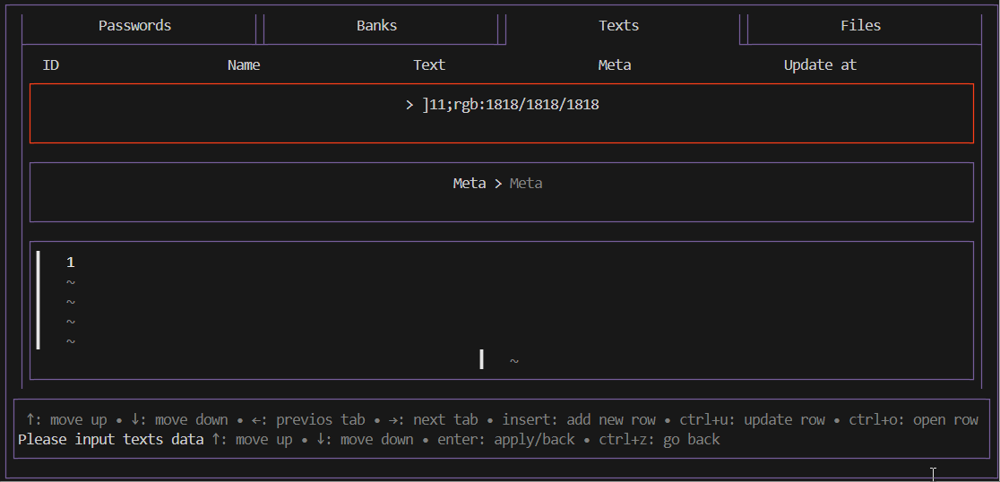

# This is GophKeeper 
A client-server application for password storage.

# Features
- Store login/password pairs;
- Store arbitrary text data;
- Store arbitrary binary data;
- Store bank card data.

# Characteristics
- A nice TUI using the bubbletea framework;
- The server stores all data in encrypted form, and the encryption key is stored only on the client;
- Client-server interaction is performed using gRPC.

# Usage
## Server
1. PostgreSQL is used as the database;
1. A migration file is prepared, to start it you need to run the following command:
```bash
   goose up
```   
3. To run the application itself, you need to download the executable file and launch it with the following parameters:
   - -dsn/env DSN - data source name;
   - -secret/env TOKEN_SECRET - key for forming tokens;
   - -f/FILE_STORAGE_PATH - path for storing binary data;
   - -a/GRPC_ADDR - address and port to run the gRPC server;
   - -td/TOKEN_DURATION - token lifespan;
   - -cs/CHUNK_SIZE - parameter that sets the maximum number of bytes the server can receive from the client (for binary information).
## Client
1. It is necessary to configure the settings. Select the path to the encryption key (or create it), enter the server address;
2. Register or log in to the service;
3. Add the login/password pair data following the prompts in the information window;
4. Add bank data;
5. Add arbitrary text information;
6. Upload a file.

# Это GophKeeper
Клиент-серверное приложения на хранения паролей.

# Возможности
- хранение пары логин/пароль;
- хранение произвольных текстовых данных;
- хранение произвольных бинарных данных;
- хранение данных банковских карт.
# Особенности
- симпатичный TUI с использованием фреймворка bubletea;
- сервер хранит все данные в зашифрованном виде, а ключ шифрования хранится только на клиенте;
- клиент-серверное взаимодействие происходит с использованием grpc.
# Использование
## Сервер
1. В качестве базы данных используется PostgreSQL;
2. Подготовлен файл с миграциями, для его запуска необходимо вызвать следующую команду
```bash
   goose up
```
3. Для запуска самого приложения необходимо скачать исполняемый файл и запустить его со следующими параметрами:
   - -dsn/env DSN - имя источника данных;
   - -secret/env TOKEN_SECRET - ключ для формирования токенов;
   - -f/FILE_STORAGE_PATH - путь хранения бинарных данных;
   - -a/GRPC_ADDR - адрес и порт для запуска grpc сервера;
   - -td/TOKEN_DURATION - срок жизни токена;
   - -cs/CHUNK_SIZE - параметр задающий максимальное количество байт, которое сервер может принять от клиента (для бинарной информации).
## Клиент
1. Необходимо настроить конфигурацию. Выбрать путь к ключу шифрования (или создать его), ввести адрес к серверу;
2. Зарегистрироваться или залогиниться в сервисе;
3. Добавить данные пары логин/пароль следуя подсказкам в информационном окне;
4. Добавить банковские данные;
5. Добавить произвольную текстовую информацию;
6. Загрузить файл
